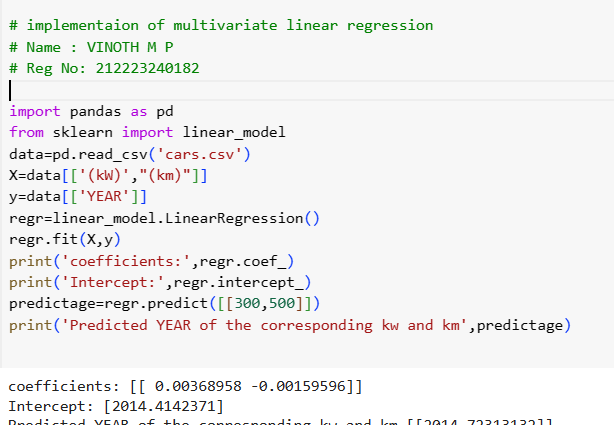

# Implementation of Multivariate Linear Regression
## Aim
To write a python program to implement multivariate linear regression and predict the output.
## Equipment’s required:
1.	Hardware – PCs
2.	Anaconda – Python 3.7 Installation / Moodle-Code Runner
## Algorithm:
### Step1
import pandas as pd

### Step2
from sklearn import linear_model

### Step3
read the csv file using pd.read_csv()

### Step4
load the data set in x and y

### Step5
fit the model with lineraregression() and print the values

## Program:
```

# implementaion of multivariate linear regression
# Name : VINOTH M P
# Reg No: 212223240182

import pandas as pd
from sklearn import linear_model
data=pd.read_csv('cars.csv')
X=data[['(kW)',"(km)"]]
y=data[['YEAR']]
regr=linear_model.LinearRegression()
regr.fit(X,y)
print('coefficients:',regr.coef_)
print('Intercept:',regr.intercept_)
predictage=regr.predict([[300,500]])
print('Predicted YEAR of the corresponding kw and km',predictage)

```
## Output:
### Insert your output




## Result
Thus the multivariate linear regression is implemented and predicted the output using python program.